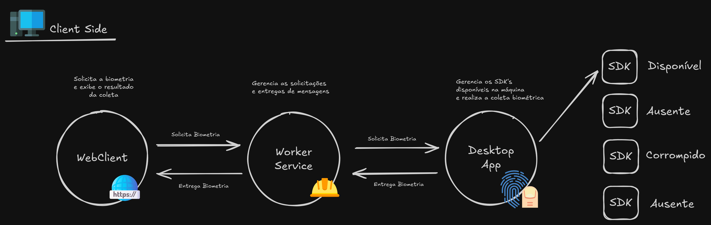

# 🧠 WebSocket Biometrics Lab

This repository is a study project that simulates a client-server architecture using WebSockets to integrate with a biometric collector. Communication flows between an Angular client, a middleware (Worker Service), and a desktop app responsible for biometric capture.

## 🧩 Architecture

### Components

- **WebClient (Angular):**
  - Interface that requests user biometric data.
  - Displays the result of the capture.
  - Connects to the Worker Service via WebSocket.

- **Worker Service (WebSocket Server):**
  - Handles incoming requests from WebClient.
  - Forwards messages to the Desktop App via WebSocket.
  - Manages message lifecycle and result delivery.

- **Desktop App (Biometric Client):**
  - Detects available biometric SDKs on the machine.
  - Performs local biometric capture.
  - Sends biometric data back to the Worker Service.

- **Biometric SDKs:**
  - May have different states: `Available`, `Missing`, `Corrupted`.
  - The Desktop App handles SDK management and availability.

## 💡 Project Purpose

- Practice WebSocket communication.
- Simulate a real-world biometric data flow (Web → Server → Local Machine).
- Explore cross-platform integration: Angular, .NET, and desktop applications.

## 📌 TODO

- [ ] Add authentication between layers.
- [ ] Simulate SDKs with different states.
- [ ] Centralized logging.
- [ ] Containerize the project.

## 🧪 Related Study Topics

- WebSockets with Angular
- .NET Worker Services and WebSocket servers
- Communication between browser and local apps
- Biometric integration and SDK management

---

Made with ☕ and curiosity 💡
